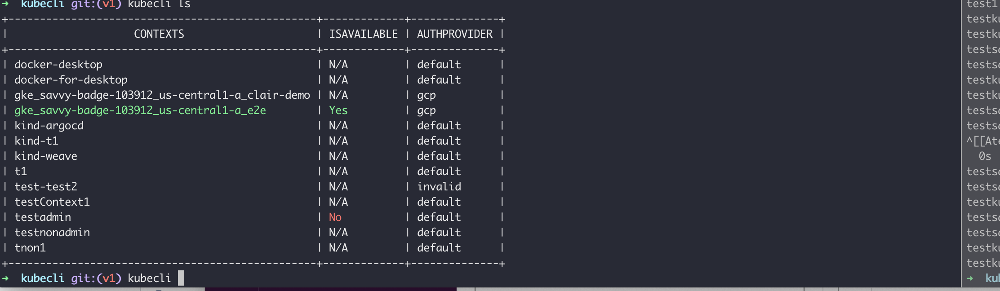

# kubecli utiliy for managing Kubernets contexts

a tool that helps more effectively use kubernetes context management , inspired by kubectx 

brew tap verchol/kubecli 
brew install /upgrade kubecli 

kubecli ls  
kubecli switch newcontext 
kubecli ns contextName --namespace newNamespace 
kubecli test contextName 
kubecli newcontext mycontext --namespaace=default --role=admin  

 
